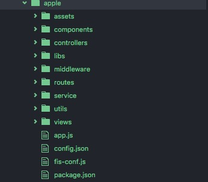
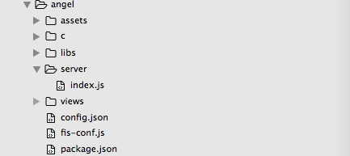

# olo

  一个自动化前端开发工程流的工具包。里面包括**seo**、**seo-php**模式。
  > _共同点_：都是具有PC端SEO优化的工作流程。都采用了node服务，通过fis3进行资源定位及优化。  
  > _区别_：  
        **seo-php**用的是generator-biketo的开发流程，模版渲染部分由PHP负责。最后产出在后台的服务上运行项目。  
        **seo**采用了node服务，以handlebars为模版引擎，实现了页面的自动路由功能。最后产出在node服务上运行。  

## 更新
**v2.0.0**

 1. 修复路由文件名限制、优化路由、增加无配置文件路由。
 2. 规范通用JS请求。
 3. 增加注释，规范代码，增加eslint,增加airbnb规范。
 4. 嵌入模拟数据。

## 安装
    npm i olo -g

## 基本命令  
> 所有命令的参数都可以通过`olo ** -h`查看  

#### 初始化
    olo init  
#### 生成视图
    olo v view-name  
#### 生成组件
    olo c component-name  
#### 监听项目
    olo w
> 启动项目中包括清空本地fis3服务文件的`server clean`，清空编译缓存、自动刷新、实时监听`release -clw`。

#### 开启服务  
    olo s  
#### 发布  
    olo r
## 新建项目
```
    mkdir my-project
    cd my-project
    olo init
    olo v view-name (可选)
    olo c component-name (可选)
    olo s (或者) npm run start
    olo w (或者) npm run watch
```
#### 一. 公用配置


#### 二. seo

##### 目录结构

```
|---- assets           # 静态文件目录
	  |---- images     # 图片文件
	  |---- scss       # 通用样式文件
|---- components/      # 页面组件文件
|---- views/           # 前端页面渲染
|---- libs/            # 前端辅助类或工具类文件
|---- mock/            # 模拟数据文件
|---- server/          # Node服务
    |---- _conf.json   # 路由配置文件
    |---- init.js      # 路由派发规则解析文件
|---- controllers/     # 前端页面渲染路由文件
|---- service/         # 前端接口路由文件
|---- middleware/      # 路由中间件    
|---- utils/           # 后端辅助类或工具类文件
|---- app.js           # 系统启动文件
|---- config.json      # 系统环境配置文件
|---- fis-conf.js      # fis3 配置文件
|---- pm2.json         # pm2 配置文件
|---- package.json     # 管理项⽬的依赖
|---- .editorconfig    # ediforconfig 代码书写配置文件
|---- .eslintrc        # eslint 代码规范性检查配置文件
|---- .gitignore       # git 仓库文件忽略配置
```
##### 注意事项
1、 页面路由  **controllers>index.js**
```javascript
module.exports = {
	路由名称: ［中间件（可选）,函数］,
	路由名称: 函数,
	index: [midUser.hasLogin,function(req,res){
		res.render('index',{username: req.session.username});
	}]
	index1 : function(req,res){
		res.render('index',{username: req.session.username});
	}
};
```
2、 页面路由配置  **server>_conf.json>controllers**  
```
一级路由:接口名称 
一级路由:{  
    二级路由:接口名称
    二级路由/三级路由: 接口名称
    二级路由:{
        三级路由:接口名称
        ```
    }
}
(或)
一级路由/二级路由: 接口名称
一级路由/二级路由/```: 接口名称

路由函数名|一级路由:接口名称
```
>*1、一级路由默认对应‘路由函数名称’，即：所有路由对应`一级路由.js`的路由函数。*  
>*2、如果需要自定义路由函数可以借助分隔符`|`,即：`路由函数名|一级路由`。*  
>*3、controllers中路由方式默认是GET。*

```javascript
"controllers": {
    "root": "../controllers",
    "map": [
        {
            "index|/": "index",
            "index": "index",
            "about/member": "member",
            "about/member": {            #默认对应about.js
                "user": "user"
            }
            "about-fn|about/member": {   #对应about-fn.js
                "user": "user"
            }
        }
    ]
}
```
3、 接口路由  **service>loginout.js**
```javascript
module.exports = {
	路由名称: 函数,
	login : function(req,res){
		//一般在这里进行数据请求
	}
};
```
4、 接口路由配置  **server>_conf.json>service**   
```javascript
一级路由:接口名称
一级路由:{
    二级路由:接口名称
}
(或)
一级路由/二级路由: 接口名称

一级路由:［请求方式，接口名称］
```
>*1、一级路由默认对应‘路由函数名称’，即：所有路由对应`一级路由.js`的路由函数。*  
>*2、如果需要自定义路由函数可以借助分隔符`|`,即：`路由函数名|一级路由`。*  
>*3、service中路由方式默认是POST,如果需要get方式，可用：`［"get","接口名"］`。*

```javascript
"service": {
    "root": "../service",
    "map": [
        {
            "member": "member",
            "auth/login": ["get", "login"],
        }
    ]
}
```

#### 三. seo-php
> 功能、用法与`generator-biketo`相类似。

##### 目录结构
  
**assets** 静态文件，包括图片和初始化css;   
**c** 组件;  
**libs** 公用类库;  
**server** node服务;  
**views** 页面视图;  
**config.json** 发布产出、接口配置;  
**fis-conf.js** fis 配置;  
**package.json** 项目包配置.
##### 注意事项
1. `{{#if dev}}`*handlebars*语法区分纯前端开发和后台模板开发；
2. `{{> cmp}}`引入组件；
3. 可以自行加入`helper`并在_conf.js_中的*handlebars*配置项中配置；

